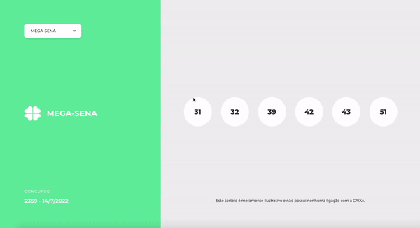

<h1 align='center' style="color:#6BEFA3">
    Lottery Results
</h1>

<p align="center">Brainn Co. Front-end challenge</p>

<p align="center">
   <a href="https://github.com/gustavonobrega">
    
   </a>
</p>

<p align="center">
  
</p>

<hr />

## 📚 About

Welcome. This is a Front-end challenge!

To learn more about the challenge, check the link [Brainn Co. Challenge](https://github.com/brainnco-exs/readme-frontend).


## 🚀 Technologies

This project was developed with the following technologies:

- [ReactJS](https://reactjs.org/)
- [TailwindCSS](https://tailwindcss.com/)
- [GraphQL](https://graphql.org/)
- [Apollo](https://www.apollographql.com/)
- [Codegen](https://www.graphql-code-generator.com/)
- [Headless UI](https://headlessui.com/)
- [React Router Dom](https://reactrouter.com/)
- [TypeScript](https://www.typescriptlang.org/)

## 💻  Getting started

```bash
# Clone this repository
$ git clone https://github.com/gustavonobrega/brainnco-challenge

# Go into the repository
$ cd brainnco-challenge

# Install dependencies
$ npm install

# Run the app
$ npm run dev
```

---

Made with ♥ by Gustavo Nobrega